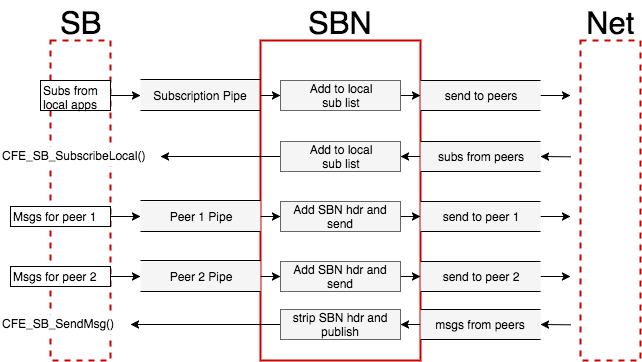
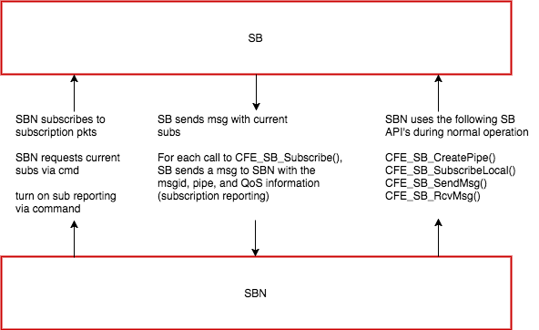
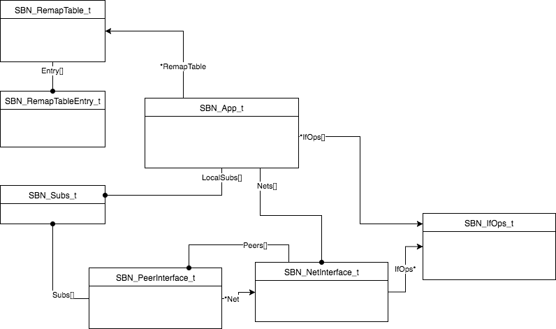

Core Flight Software (cFS) Software Bus Networking (SBN)
========================================================

Documentation Version History
------------------------------
This document details the design and use of the SBN application. This is current
as of SBN version 1.6.

This document is maintained by [Chris Knight, NASA Ames Research Center]
(Christopher.D.Knight@nasa.gov).

SBN Version History
-------------------
- SBN 1.0 – UDP-only monolithic application.
- SBN 1.1 – Added a modular network layer for Spacewire, Serial.
- SBN 1.2 @ce1b3ca – TCP module. Merged protocol and data traffic into
  the same connections/sockets. Heartbeats only sent if no other traffic
  sent in the last number of seconds. Bug-fix to ensure SBN ignores messages it
  publishes on the SB, ensures all network messages are big-endian and aligned,
  removes windowing/retransmit logic.
- SBN 1.3 @15f3754 – Removed sync word. Simplified module API, added MID
  remapping/filtering. Added the (compile-time) option of per-peer tasks for
  watching pipes and net.
- SBN 1.4 @2b6556a – DTN module. Pushed protocol handling (announce/heartbeat)
  down into the modules that need it (UDP.)
- SBN 1.5 @b5cb3d7 – When sending all subs, send them in one message.
- SBN 1.6 @b0d0027 – Added “unload” method to modules.

Overview
--------
SBN is a cFS application that connects the local software bus to one or more
other cFS nodes (who are also running SBN) such that all messages sent by an
application on one bus will be received by an application on another bus. SBN
has a modular *network* architecture (TCP, UDP, Serial, SpaceWire, etc.) to
connect *peers* and supports multiple peer networks with a local *host*
connection affiliated with each. SBN also remaps and filters messages (cFS
table-configured.)

SBN Build and Configuration
---------------------------

SBN is built like any other cFS application, either via specifying it in 
the the `TGT#_APPLISTS` parameter in the targets.cmake (for the CMake build)
or `THE_APPS` in the Makefile (for the "classic" build). Protocol modules
(`sbn_udp`, `sbn_tcp`, `sbn_dtn`, ...) should also be specified as an
application in the build process (and the module should be linked or copied
to the apps source directory). SBN must be defined as an application
in the `cfe_es_startup.scr` script but Modules should *not* be defined there.

SBN uses two runtime text configuration files (in the same model as
`cfe_es_startup.scr`, with one line per configuration and multiple columns,
separated by commas.) `SbnModuleData.dat` specifies the protocol modules
SBN should load at startup. `SbnPeerData.dat` specifies which protocol
and which protocol options (such as IP address, port number, DTN endpoint, etc.)
is required to communicate with that peer. Note that the `SbnPeerData.dat`
file should be the same for all peers, and that the file should include
at least one entry for the local system (sometimes this is referred to as
the "host" entry.)

### SBN Platform Configuration

The `sbn_platform_cfg.h` file contains a number of definitions that control
how SBN allocates and limits resources as well as controlling the behavior
of SBN. Most "max" definitions relate to in-memory static arrays, so increasing
the value increases the memory footprint of SBN (in some cases, non-linearly.)

### SBN Remapping Table

The SBN remapping table is a standard cFS table defining, on a peer-by-peer
basis, which message ID's should be remapped to other ID's, or which
message ID's should be filtered (where the "To" field is 0).

See `sbn_tables.h` and `sbn_remap_tbl.c`.

### SbnModuleData.dat File Format

The `SbnModuleData.dat` file is comprised of a number of rows, one per protocol
module, with four columns:

- Protocol ID - The ID used to in the SbnPeerData.dat file to identify which
  module to use to communicate to that peer.
- Module Name - The name of the module (used in debug/error CFE events.)
- Module Shared Library Filename - The path/file name used to load the
  shared library of the module.
- Module interface symbol - The name of a global symbol that is of the type
  `SBN_IfOps_t`.

Fields are separated by commas (`,`) and lines are terminated with a semicolon
(`;`). The first line starting with an exclamation mark (`!`) is considered the
end of the file and all further text in the file is ignored (use with caution!)

For example:

    1, UDP, /cf/sbn_udp.so, SBN_UDP_Ops;
    2, TCP, /cf/sbn_tcp.so, SBN_TCP_Ops;
    8, DTN, /cf/sbn_dtn.so, SBN_DTN_Ops;
    ! Module ID, Module Name, Shared Lib, Interface Symbol

### SbnPeerData.dat File Format

Once SBN has loaded modules via the `SbnModuleData.dat` file, it then loads the
peer configuration file. Peers are grouped into "networks", all peers in the
same network share messages equally (there is no routing or bridging between
networks, but there can be filtering and remapping of message ID's between
peers.) Networks are particularly important to identify the interface specifics
of the local system (the "host" interface), particularly in connection-less
(UDP and DTN) protocols.

The fields in the peer data file are:
- CPU Name - for debug/information event message text.
- CPU ID - must match the return value of `CFE_PSP_GetProcessorId()` for the
  system (normally `CFE_CPU_ID`).
- Protocol ID - to determine which module to use to communicate with this
  peer.
- Spacecraft ID - Must match the spacecraft ID for the peer/host.
- QoS - The QoS bitfield (currently unused.)
- Network Name - For grouping peers and host interfaces.
- *network-specific fields* - All remaining fields are passed to the protocol
  module, specifying how to address the host/peer.

For example:

    CPU1, 1, 8, 42, 0, SBN0, ipn:1.1;
    CPU2, 2, 8, 42, 0, SBN0, ipn:1.2;
    CPU3, 3, 8, 42, 0, SBN0, ipn:1.3;

    CPU4, 1, 1, 0xCC, 0, SBN1, 127.0.0.1, 15820;
    CPU5, 2, 1, 0xCC, 0, SBN1, 127.0.0.1, 15821;
    CPU6, 3, 1, 0xCC, 0, SBN1, 127.0.0.1, 15822;

SBN Interactions With the Software Bus (SB)
-------------------------------------------

SBN treats all nodes as peers and (by default) all subscriptions of local
applications should receive messages sent by publishers on other peers, and
all messages published on the local bus should be transmitted to any peers
who have applications subscribed to that message ID.

The Software Bus (SB), when an application subscribes to a message ID or
unsubscribes from a message ID, sends a message that SBN receives. Upon
receipt of these messages, SBN updates its internal state tables and sends
a message to the peers with the information on the update.

SBN Scheduling and Tasks
------------------------

SBN has two modes of operation (configured at compile time):

- A traditional scheduler (SCH)-driven mode where SCH sends a wakeup message
  periodically and SBN polls pipes and network modules. SBN has a built-in
  timeout period so that if SCH is somehow not functioning properly, or is
  mis-configured, SBN will continue to function. This mode is preferable
  in environments where resources are constrained, where network traffic
  load is well understood, and deterministic behavior is expected.

- A per-peer task model where the local SBN instance creates two tasks for
  every peer--one task blocks on reading the local pipe (waiting for messages
  to send to the respective peer) and the other task blocks on the network
  module's "receive" function, waiting for messages from the peer to send
  to the local bus. This model is preferred in environments where network
  traffic load may vary significantly (posing a risk of overloading pipes),
  and where determinism is not expected and resources are not particularly
  constrained.

Technically, the choice of task or SCH-driven processing is set for
each direction ("sending" local bus messages to the peer and "receiving"
messages from the peer to put on the local bus.) However, it's generally
best to stick with either SCH-driven processing or task-driven processing.

SBN Protocol Modules
--------------------

SBN requires the use of protocol modules--shared libraries that provide a
defined set of functions to send and receive encapsulated software bus messages
and subscription updates. Protocol modules may use connection-less (UDP)
or connection-based (TCP) network technologies and network reliability and
connection maintenance is expected to be provided by the module or the
network technology it is using. SBN does benefit from knowing when a peer
is "connected" so that the local subscriptions can be sent (in bulk) to
that peer; otherwise SBN does not need to know the state of the network
the module is communicating with.

SBN modules are built as separate cFS "applications" but are not loaded via the
Executive Service (ES) interface, instead the module is loaded by the SBN
application (as defined by a start-time configuration file.)

Currently SBN provides the following modules:
- UDP - Utilizing the UDP/IP connectionless protocol, the UDP module uses
  "announce" and "heartbeat" internal messages to determine when a peer has
  connected to the network (and that the subscriptions need to be sent.)
  Otherwise no network reliability is provided by the UDP module, packets
  may be lost or jumbled without the knowledge of SBN.

- TCP - The TCP module utilizes the Internet-standard, high reliability TCP
  protocol, which provides for error correction and connection management.

- DTN - Integrating the ION-DTN 3.6.0 libraries, the DTN module provides
  high reliability, multi-path transmission, and queueing. Effectively,
  DTN peers are always connected.

SBN Datastructures
------------------

SBN utilizes a complex set of data structures in memory to track
the state of the local system and its state knowledge of the peers on
the network. Much of the current state is stored in "housekeeping"
structures (structures that can be sent to the SB upon request
via SBN commanding) to reduce redundancy.

